# 🛒 API de Productos - Node.js + MongoDB

## 📌 Descripción

Este proyecto consiste en una API REST desarrollada con Node.js, Express y MongoDB utilizando Mongoose. Permite realizar operaciones CRUD (Crear, Leer, Actualizar y Eliminar) sobre una colección de productos.

Cada producto contiene:

- Nombre (obligatorio)
- Precio (obligatorio)
- Disponibilidad (por defecto: false)

---

## ⚙️ Instalación y ejecución

### 🔹 1. Clonar el repositorio

```bash
git clone https://github.com/TU-USUARIO/TU-REPO.git
cd TU-REPO
```

### 🔹 2. Instalar dependencias

```bash
npm install
```

### 🔹 3. Configurar variables de entorno

Crear un archivo `.env` en la raíz del proyecto:

### 🔹 4. Ejecutar el servidor

```bash
node server.js
```

o (si usás nodemon):

```bash
npm run dev
```

---

## 🚀 Endpoints de la API

### 🔹 Obtener todos los productos

**GET** `/products`

---

### 🔹 Obtener producto por ID

**GET** `/products/:id`

---

### 🔹 Crear producto

**POST** `/products`

```json
{
  "name": "Laptop",
  "price": 1200,
  "available": true
}
```

---

### 🔹 Actualizar producto

**PUT** `/products/:id`

```json
{
  "name": "Laptop Gamer",
  "price": 1500
}
```

---

### 🔹 Eliminar producto

**DELETE** `/products/:id`

---

## 📸 Capturas de pantalla

### Ejemplo de uso en Postman, Mongo DB y Consola

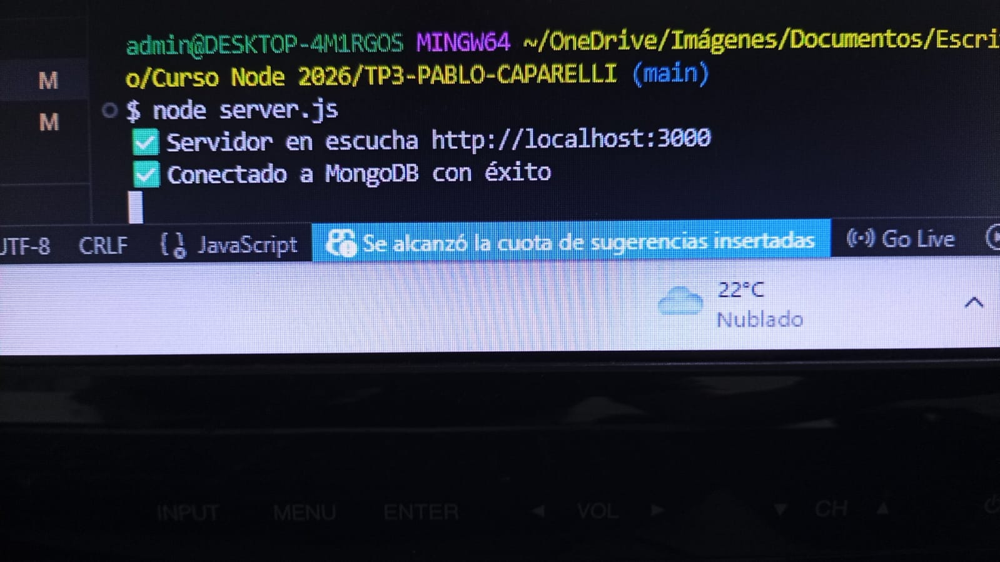
.jpeg>)

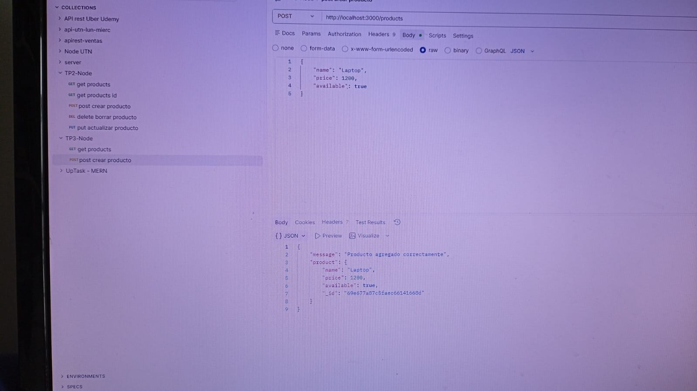
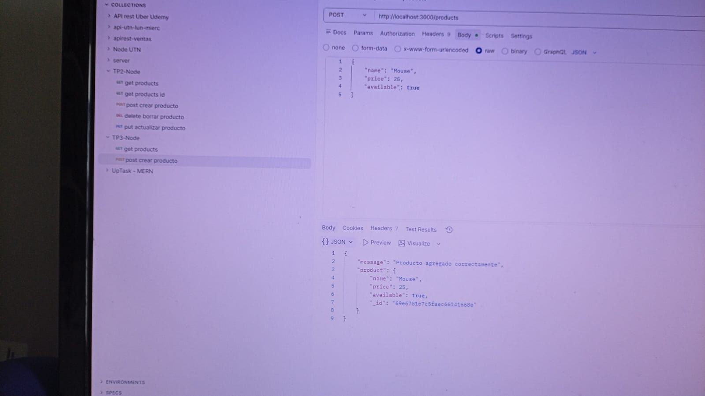

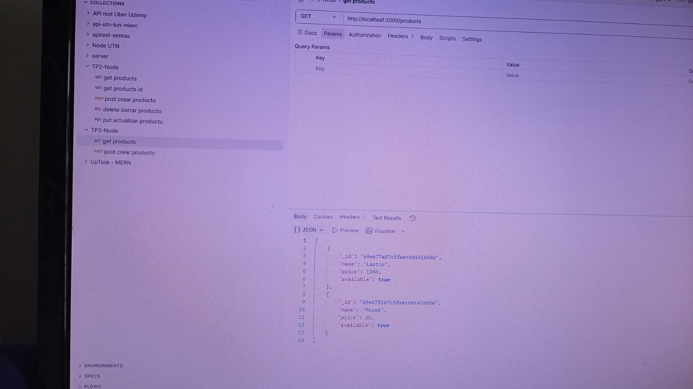
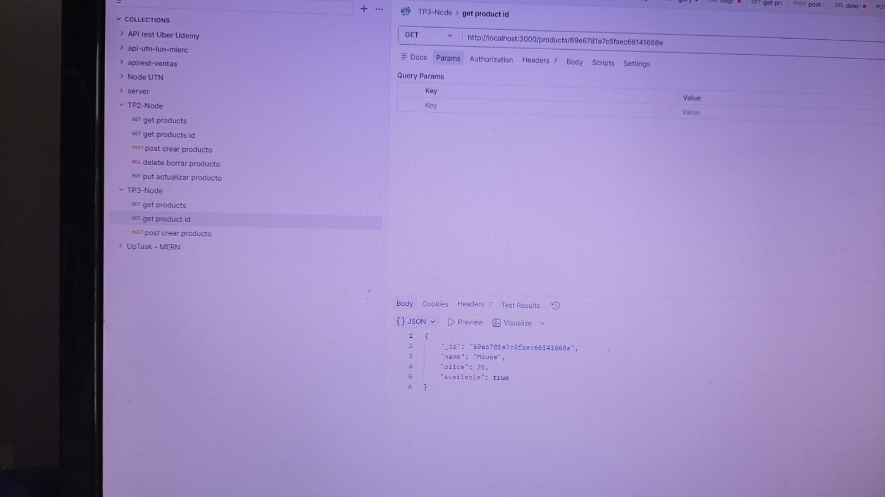

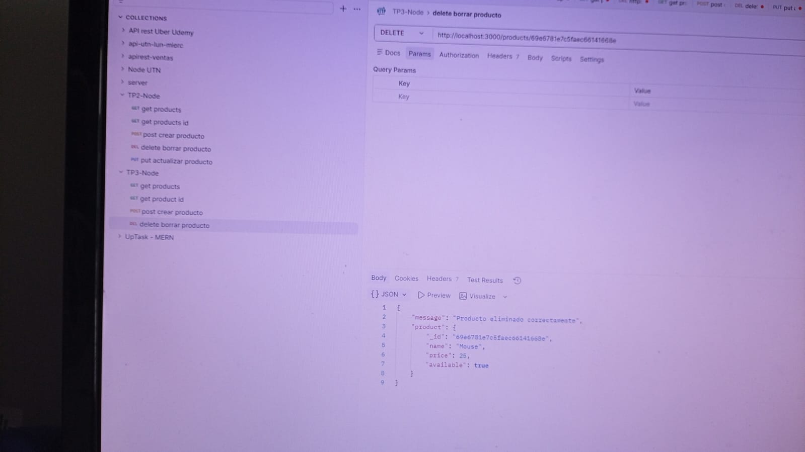
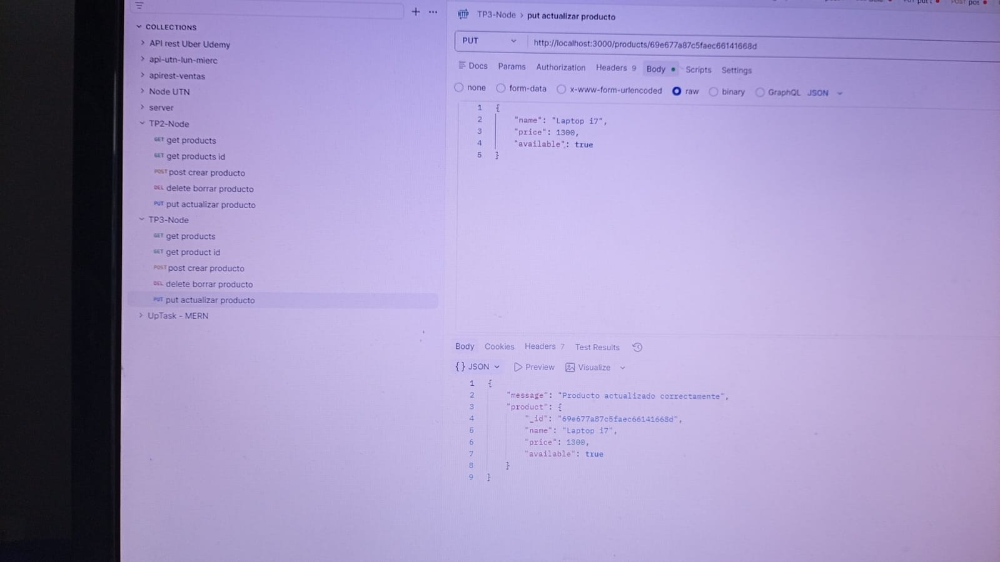

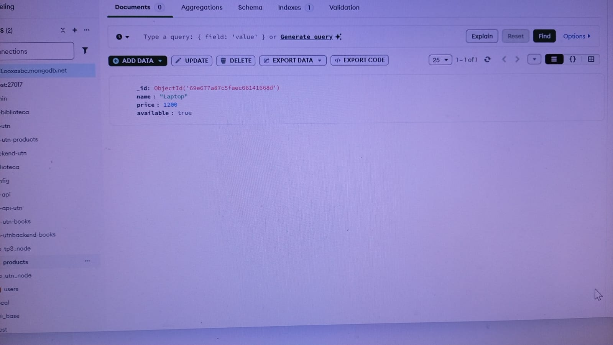
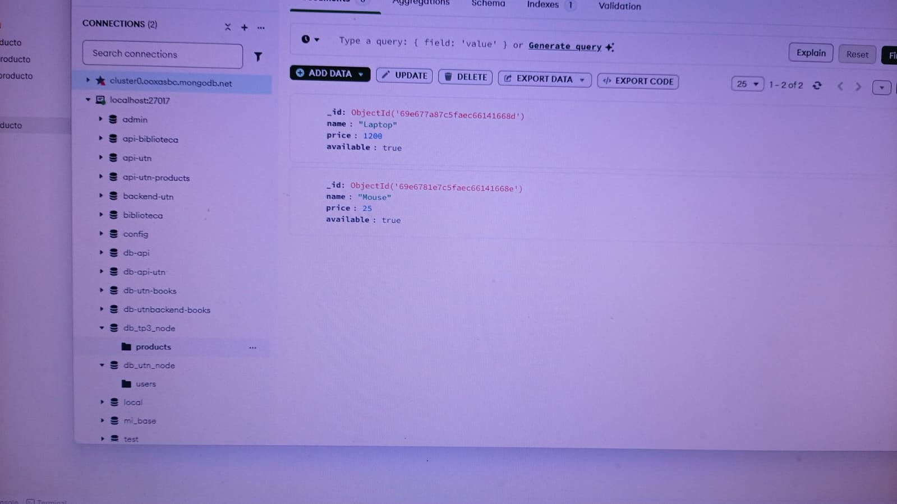

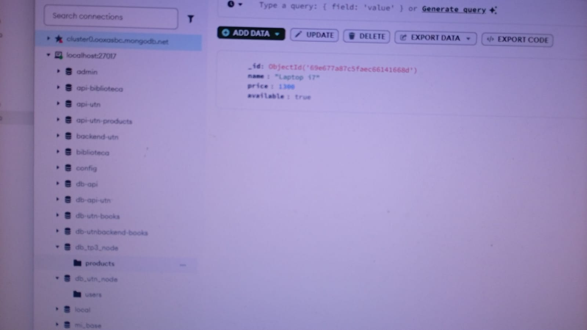
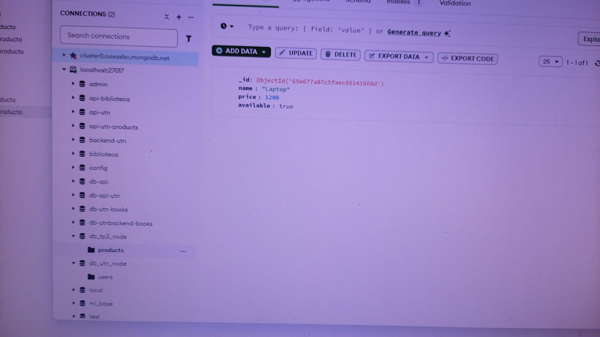

Ejemplo:

- Crear producto (POST)
- Obtener productos (GET)
- Actualizar producto (PUT)
- Eliminar producto (DELETE)

## 📁 Estructura del proyecto

📦 proyecto
┣ 📄 server.js
┣ 📄 package.json
┣ 📄 .env
┣ 📄 .gitignore
┗ 📄 README.md

👨‍🎓 Créditos
Nombre: Pablo Caparelli
Desarrollo con Node
Diplomatura en Professional Full-Stack Developer
Comisión 999201567
TP3: MongoDB

## ✅ Tecnologías utilizadas

- Node.js
- Express
- MongoDB
- Mongoose
- Dotenv

---

## 📌 Notas

- El archivo `.env` está ignorado en `.gitignore`
- Se utilizan variables de entorno para mayor seguridad
- La API sigue una estructura REST
